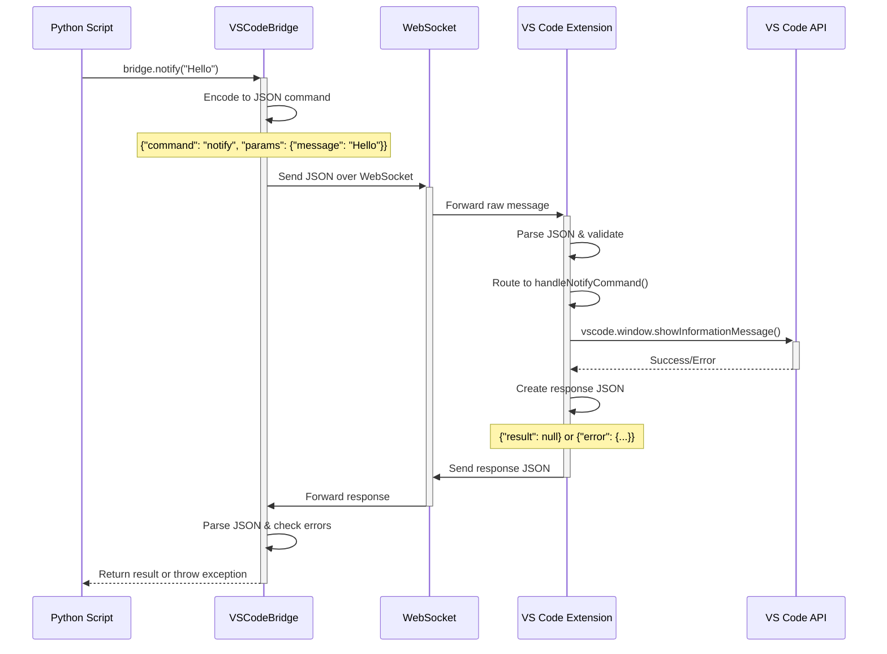

# Python-VS Code Bridge

A minimal demonstration of Python-to-VS Code communication via WebSocket. This project showcases how Python scripts can interact with VS Code editors through a simple WebSocket bridge.

**🎯 Quick Start**: Run `python demo.py` for an interactive demonstration of all capabilities!

## 🎯 Purpose

This repository provides a **minimum reproducible example** of bidirectional communication between Python and VS Code, demonstrating:

- 📢 Sending notifications to VS Code from Python
- 📋 Getting information about open editors
- 📖 Reading text content from specific files
- ✏️ Modifying text content in the active editor

## 🏗️ Architecture

```
┌─────────────────┐    WebSocket     ┌──────────────────┐
│                 │   (port 60123)   │                  │
│  Python Script  │ ◄──────────────► │  VS Code         │
│                 │    JSON Messages │  Extension       │
└─────────────────┘                  └──────────────────┘
```

### Components

- **VS Code Extension** (`src/`): WebSocket server that handles commands  
- **Demo Workspace** (`workspace/`): Contains all demo files opened by Extension Development Host
  - `python_client/`: Python client library
  - `examples/`: Demonstration scripts
  - `demo.py`: Interactive demonstration script
  - Sample files: `test-file.txt`, `sample.js`, `sample.py`

## 🚀 Quick Start

### 1. Install VS Code Extension

```bash
# Install dependencies
yarn install

# Compile extension
yarn compile
```

### 2. Launch Extension

- Press `F5` in VS Code to launch Extension Development Host
- The Extension Development Host will open the `workspace/` folder with demo files
- The extension will start automatically and create a WebSocket server on port 60123

### 3. Install Python Dependencies

In the **Extension Development Host** window (the one that opened from F5):

1. **Open Terminal in VS Code:**
   - Press `Ctrl+`` (backtick) or `Cmd+`` on Mac
   - Or use menu: **Terminal → New Terminal**

2. **Install Python dependencies:**
   ```bash
   pip install -r python_client/requirements.txt
   ```

### 4. Run the Interactive Demo

In the same terminal in VS Code:

```bash
# Run the complete interactive demonstration
python demo.py
```

This will walk you through all the bridge capabilities with explanations and real-time demonstrations.

### 5. Or Run Individual Examples

```bash
# Basic notification
python examples/basic_notify.py

# Get editor information  
python examples/editor_info.py

# Text manipulation
python examples/text_replacement.py

# Complex workflow
python examples/automated_workflow.py
```

💡 **Note**: All Python commands should be run in the VS Code terminal within the Extension Development Host window.

## 📡 API Reference

### VS Code → Python Commands

The extension accepts JSON messages with this structure:

```json
{
  "command": "command_name",
  "params": {
    // command-specific parameters
  }
}
```

#### Available Commands

| Command | Description | Parameters |
|---------|-------------|------------|
| `notify` | Display notification in VS Code | `message`: string |
| `get_titles_of_active_editors` | Get list of open editors | none |
| `get_text_from_named_editor` | Get text from specific file | `filename`: string |
| `set_text_of_active_editor` | Set text in active editor | `text`: string |

### Python Client API

```python
from vscode_bridge import VSCodeBridge

bridge = VSCodeBridge()

# Send notification
bridge.notify("Hello from Python!")

# Get editor information
editors = bridge.get_editor_titles()

# Read file content
content = bridge.get_text_from_editor("filename.txt")

# Set active editor content
bridge.set_active_editor_text("New content")
```

## 📝 Examples Explained

### 1. Basic Notification (`basic_notify.py`)
Demonstrates the simplest integration: sending a notification from Python to VS Code.

### 2. Editor Information (`editor_info.py`)
Shows how to query VS Code for information about all currently open editors.

### 3. Text Replacement (`text_replacement.py`)
Demonstrates reading content from a file and replacing the active editor's content.

### 4. Automated Workflow (`automated_workflow.py`)
Complex example that combines all APIs to perform automated code analysis:
- Scans all open files
- Counts errors, warnings, and TODOs
- Generates a comprehensive report
- Displays results in VS Code

## 🔧 Development

### Building the Extension

```bash
# Development build with sourcemap
yarn compile

# Watch mode for development
yarn watch

# Production build (minified)
yarn vscode:prepublish

# Type checking only
yarn typecheck
```

### Testing

1. Launch the extension in VS Code (`F5`)
2. Open some test files in the Extension Development Host
3. Run the Python examples from the terminal
4. Observe notifications and text changes in VS Code

## 📊 Protocol Details

### WebSocket Connection
- **Port**: 60123 (localhost only)
- **Protocol**: JSON-based message exchange
- **Connection**: Single persistent connection per Python client

### Message Format

**Request:**
```json
{
  "command": "notify",
  "params": {
    "message": "Hello World"
  }
}
```

**Success Response:**
```json
{
  "result": null
}
```

**Error Response:**
```json
{
  "error": {
    "message": "Error description",
    "code": 400
  }
}
```

## 🎯 Design Pattern Implementation

This project demonstrates the **Command Design Pattern** - a behavioral design pattern that encapsulates requests as objects, allowing you to parameterize clients with different requests and queue operations.

### Command Pattern Components

1. **Command Interface**: JSON message structure defining `command` and `params`
2. **Concrete Commands**: Specific commands like `notify`, `get_titles_of_active_editors`
3. **Invoker**: Python client (`VSCodeBridge`) that creates and sends commands
4. **Receiver**: VS Code extension (`GenericWebSocketServer`) that executes commands
5. **Client**: Python scripts that use the bridge to perform operations

### Benefits of Command Pattern

- **Decoupling**: Python scripts don't need to know VS Code API details
- **Extensibility**: New commands can be added without modifying existing code
- **Undo/Redo Potential**: Commands could be stored and replayed
- **Queuing**: Multiple commands can be batched and executed sequentially
- **Logging**: All command execution can be logged for debugging

## 🔄 Command Encoding/Decoding Process

### Data Flow Architecture



### Command Encoding Process

1. **Python Method Call**: `bridge.notify("Hello from Python!")`
2. **Command Object Creation** (`vscode_bridge.py:146-152`):
   ```python
   command = {
       "command": "notify",
       "params": {"message": message}
   }
   ```
3. **JSON Serialization** (`vscode_bridge.py:114`): `json.dumps(message)`
4. **WebSocket Transmission**: Raw JSON string sent over WebSocket connection
5. **VS Code Reception** (`websocketServer.ts:64`): Buffer converted to string
6. **JSON Parsing** (`websocketServer.ts:71`): `JSON.parse(message)`
7. **Command Validation**: Check for required `command` field and valid structure

### Command Decoding & Execution Process

1. **Command Router** (`websocketServer.ts:183-217`): Switch statement routes to handler
2. **Parameter Validation**: Each handler validates required parameters
3. **VS Code API Call**: Handler calls appropriate VS Code API
4. **Response Generation**: Success/error response object created
5. **JSON Serialization**: Response serialized to JSON string
6. **WebSocket Response**: JSON sent back to Python client
7. **Python Parsing** (`vscode_bridge.py:118`): JSON parsed and errors checked
8. **Result Extraction**: Return `result` field or raise `VSCodeBridgeError`

### Error Handling Flow

Commands can fail at multiple stages:

- **Connection Errors**: WebSocket connection unavailable
- **JSON Errors**: Malformed JSON in either direction  
- **Validation Errors**: Missing or invalid command parameters
- **Execution Errors**: VS Code API calls fail
- **Application Errors**: No active editor, file not found, etc.

Each error is encoded as:
```json
{
  "error": {
    "message": "Description of what went wrong",
    "code": 400|404|500
  }
}
```

## 🎓 Academic Value

This project demonstrates several important software engineering concepts:

1. **Command Design Pattern**: Encapsulating requests as objects for flexible execution
2. **Inter-Process Communication**: WebSocket-based messaging between different runtimes
3. **Protocol Design**: JSON-based command/response protocol with error handling
4. **Error Propagation**: Comprehensive error management across distributed systems
5. **Client-Server Architecture**: Clear separation of concerns between components
6. **Language Integration**: Bridging Python and TypeScript/JavaScript ecosystems
7. **Serialization/Deserialization**: JSON encoding/decoding for data transmission
8. **Validation Patterns**: Parameter validation and type checking across boundaries

## 🔄 Extending the Bridge

To add new commands:

1. **Add command handler in VS Code** (`src/websocketServer.ts`):
```typescript
case 'your_new_command':
    return await this.handleYourNewCommand(message.params);
```

2. **Add method to Python client** (`python_client/vscode_bridge.py`):
```python
def your_new_method(self, param: str) -> str:
    command = {
        "command": "your_new_command",
        "params": {"param": param}
    }
    response = self.send_json_message(command)
    return response.get('result')
```

## 📋 Requirements

- **VS Code**: Version 1.74.0 or higher
- **Node.js**: Version 16.x or higher
- **Python**: Version 3.7 or higher
- **Dependencies**: Listed in `package.json` and `requirements.txt`

## 🐛 Troubleshooting

### Common Issues

1. **Port 60123 already in use**: Close other applications using this port
2. **Connection refused**: Ensure VS Code extension is running
3. **Import errors in Python**: Verify `websocket-client` is installed
4. **Extension not loading**: Check VS Code developer console for errors

### Debug Mode

Enable debug logging by setting:
```python
import logging
logging.basicConfig(level=logging.DEBUG)
```

## 📄 License

This project is provided as an educational example. Use and modify freely for academic and research purposes.

## 🤝 Contributing

This is a demonstration repository, but improvements and additional examples are welcome!

---

**Next Steps**: Copy this working implementation to a new repository for standalone distribution and further development.